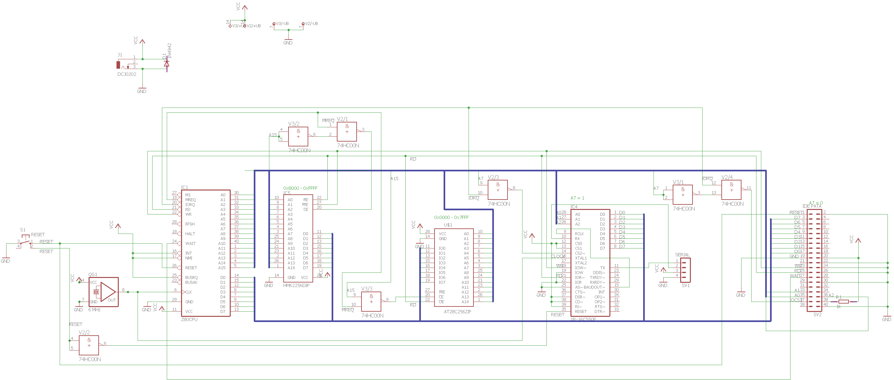

# Crazy Programmable Device (CPD)

##(Planned) Features
* 6MHz Z80 Processor
* UART Serial Communication
* 32k RAM
* 32k ROM
* CF Card Support (FAT16 or FAT12)

##Memory layout:
| Address       | Type |
| ------------- | ------------- |
| 0x0000-0x7FFF | ROM  |
| 0x8000-0xFFFF | RAM  |

##IO
| A7 | A6 | A5 |      Device         |
| -- | -- | -- | ------------------- |
| 0  | 0  | 0  | IDE Port (CF Card)  |
| 0  | 0  | 1  | UART (16550)        |

## Boot:
* start at 0x0000.
* load Bootsector from CF card to 0x8000
* jump to 0x8000
* Bootsector loads FAT files, executes KERNEL.ULF or something like that. Autoexec.
## Circuit Diagram

